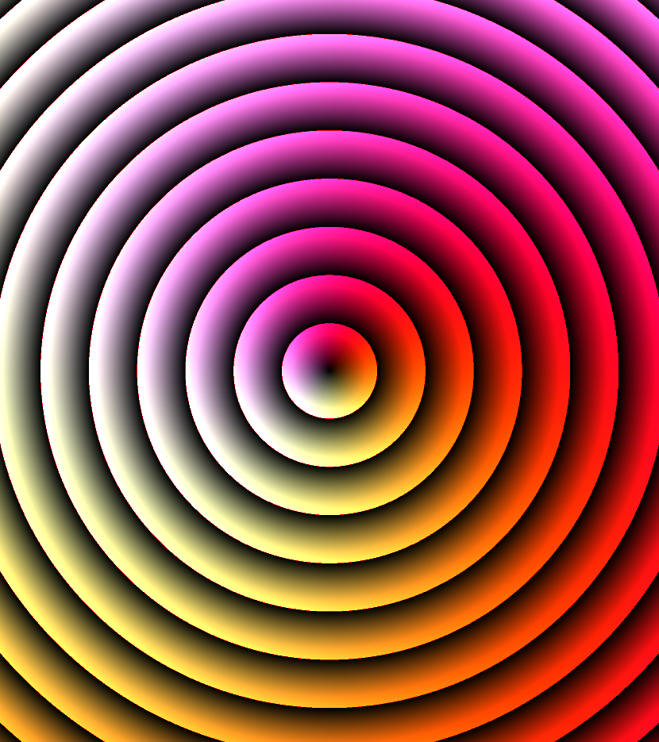

# shaders!

    
    
    
    
    
    
    
    

A place for learning and experimentation with GLSL pixel shaders.

### Folder Structure

#### experiments

A sandbox area for exploring various ideas.

#### techniques

Simpler shaders that centre around one reusable technique.

#### tools

Utility functions for debugging and general development.

#### tutorials

Shaders made as part of step-by-step tutorials.

## Setup

This repo is designed to be used with VS Code.

To render a shader:
1. In VS Code, install the [Shader Toy](https://marketplace.visualstudio.com/items?itemName=stevensona.shader-toy) extension
2. Open a shader file (.frag)
3. Inside the file, right-click -> Shader Toy: Show GLSL Preview
4. To see the code alongside in a split view, drag the tab over one half of the screen 

For auto-formatting in VS Code:
1. Install the [glsl_analyzer](https://marketplace.visualstudio.com/items?itemName=nolanderc.glsl-analyzer) extension
2. When editing a file, press ALT+SHIFT+F 

For Linting, install the [Shader languages support for VS Code](https://marketplace.visualstudio.com/items?itemName=slevesque.shader) extension

## Learning Resources

[An introduction to Shader Art Coding](https://www.youtube.com/watch?v=f4s1h2YETNY)

[Articles by Inigo Quilez](https://iquilezles.org/articles/)

[The Book of Shaders](https://thebookofshaders.com/)

[Mini Shader Tutorials by XOR](https://substack.com/@xordev)

[Shadertoy - Unofficial Blog](https://shadertoyunofficial.wordpress.com/)

[Tone Mapping](https://64.github.io/tonemapping/)
  - [Tone Mapping Comparison GLSL](https://www.shadertoy.com/view/lslGzl)

### Online Tools

[Graphtoy](https://graphtoy.com/)

[Colour Palette Generator](http://dev.thi.ng/gradients/)

### Community Examples

[Shadertoy](https://www.shadertoy.com/)

[Cineshader](https://cineshader.com/gallery)
